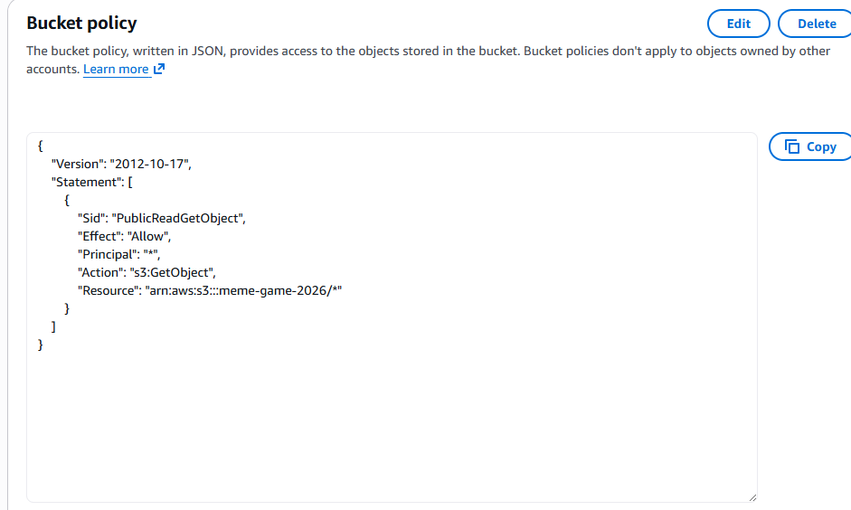
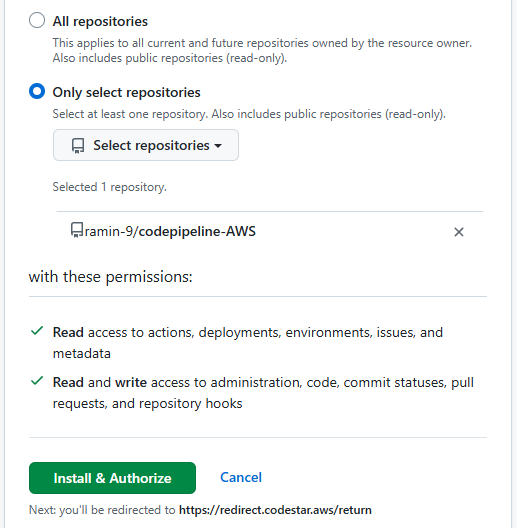
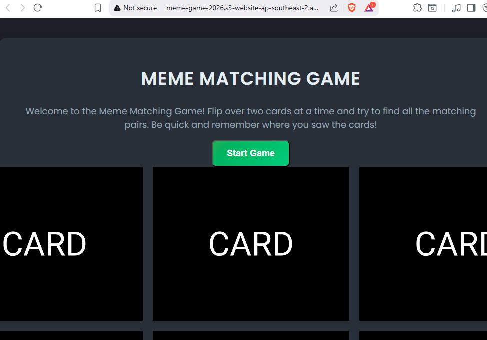

#  AWS Code Pipeline 

## The Game
A simple memory matching game.  The user clicks two cards (images of memes) to try to match them.  If there's a match, the cards disappear from the board.  If there's no match, the cards are flipped back to their blank side so the user can try again.

The game consists of HTML, CSS and JavaScript.

## Screenshots
- Policy Bucket

- CodePipeline

- Website

